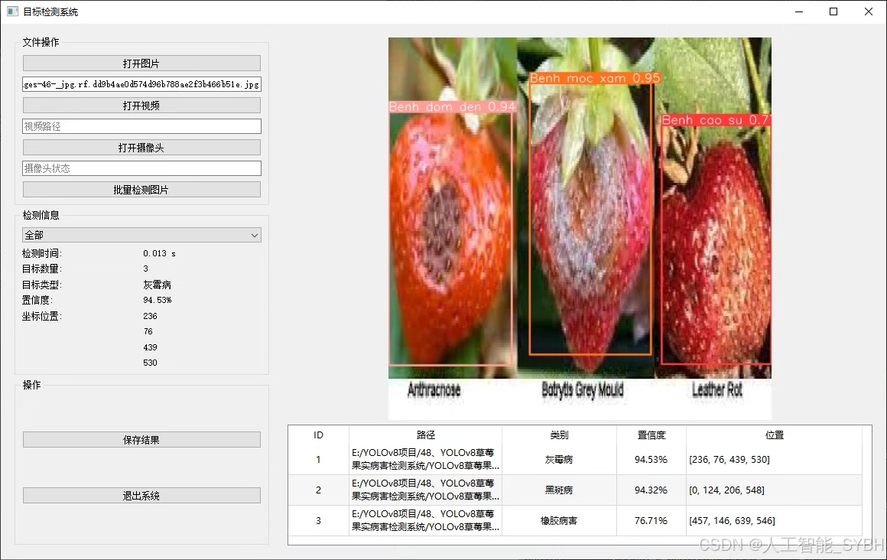
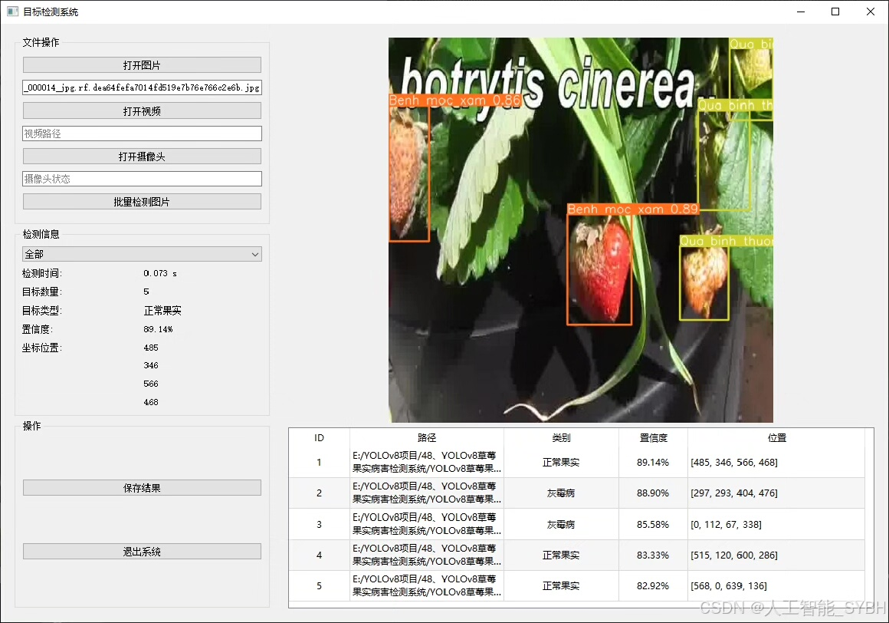
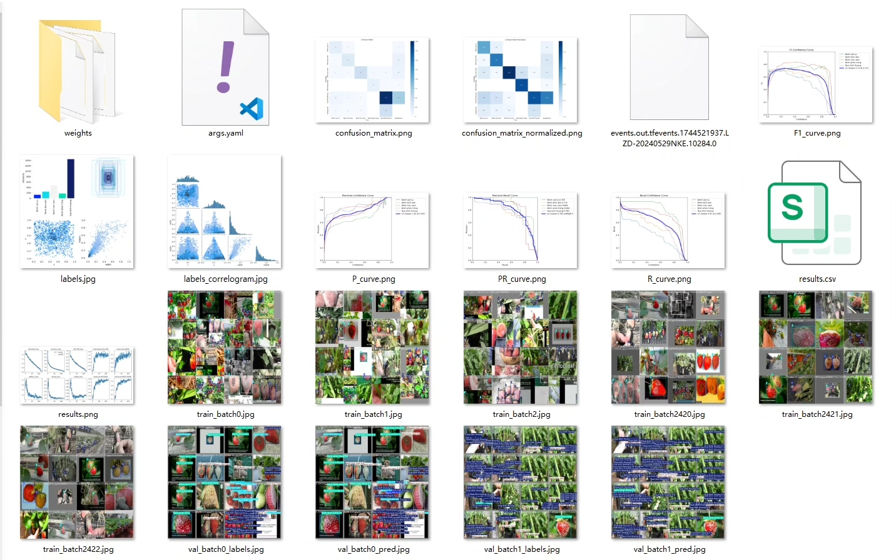
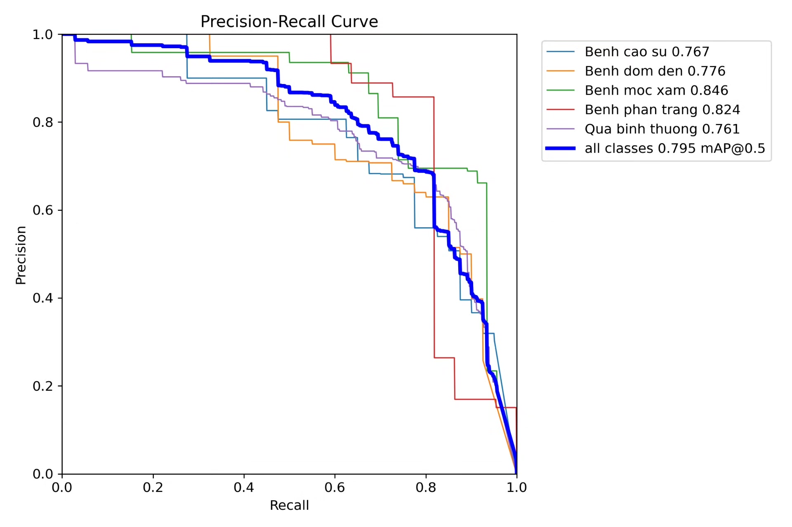
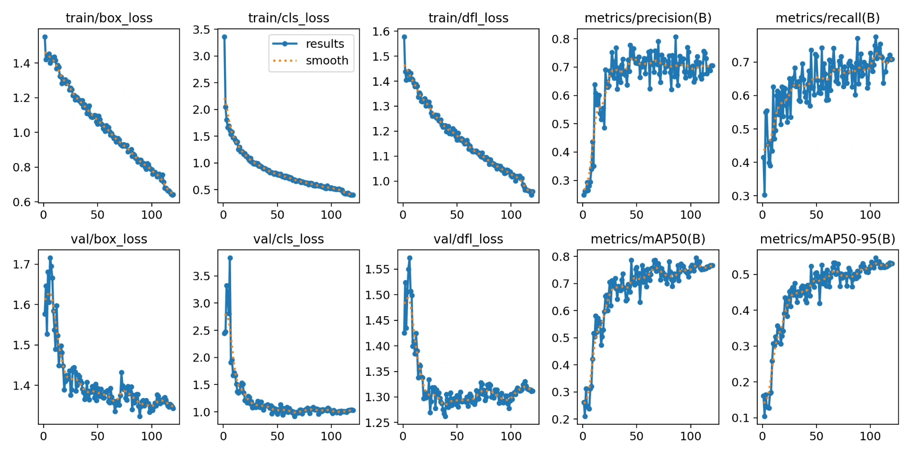
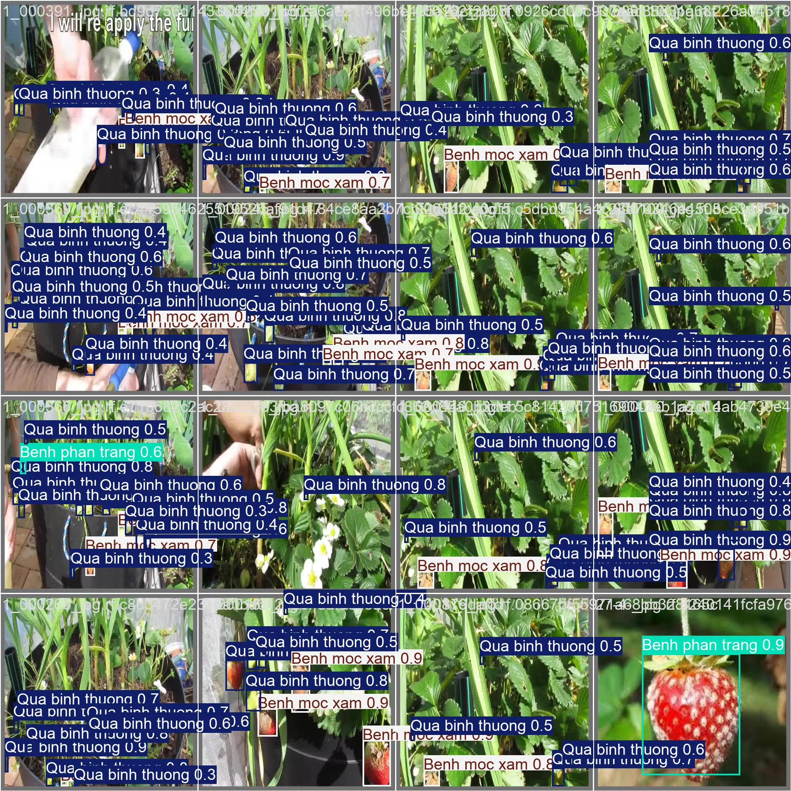
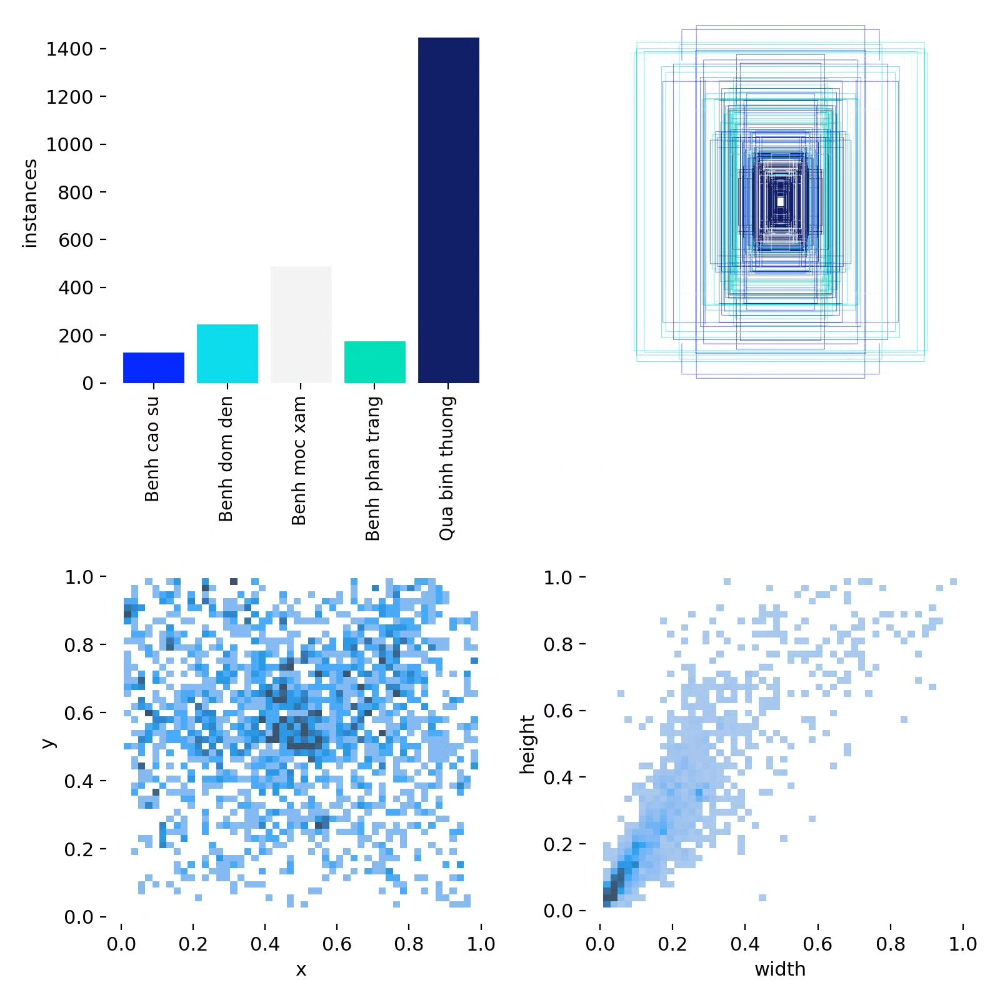
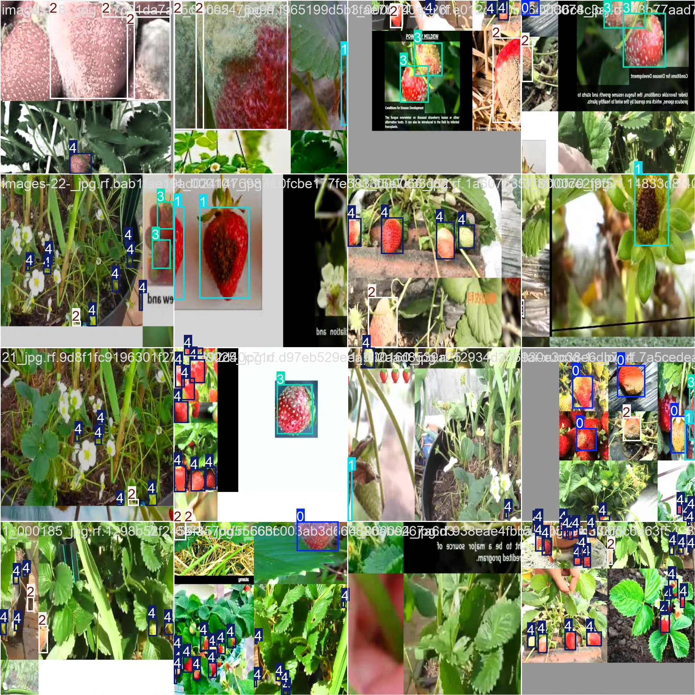

# Square berry disease detection system based on YOLOv8 deep learning

## Body

Based on the advanced YOLOv8 deep learning framework, this project has developed a high-precision intelligent detection system for strawberry fruit diseases. The system can accurately identify five key states: ['Benh cao su', 'Benh dom den', 'Benh moc xam', 'Benh phan trang', 'Qua binh thuong']. Based on a professional dataset containing 700 training images, 81 validation images, and 103 test images, this system achieves rapid and automated diagnosis of the health status of strawberry fruits.

The company's products have obtained YOLO official commercial license certification.

We provide after-sales service.

After payment, we will provide WeChat ID to answer questions anytime.

Environment configuration: We will provide an environment configuration tutorial, and WeChat will provide答疑.

Remote installation service: If you need remote configuration, an additional fee of 69 is required,

Configuration failure, all fees are refunded (specially for old computers only refund installation fees)

Retraining dataset: After configuring the environment, you can train on your own computer.
If you need us to retrain, just pay 69 + computing power fees (2.5 yuan/hour)

Full after-sales service

## Images

## Payment

Here is a pay link on Stripe ( https://buy.stripe.com/3cs8yP7sY87d0vu9AB ). Please contact me lonlonago@foxmail.com after funding $89, and I will send you a complete data files , thank you!

